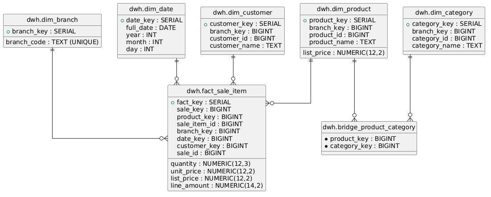
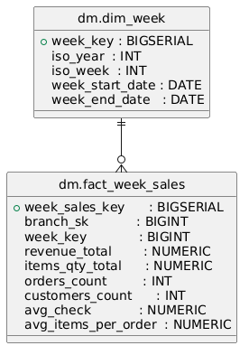

# Data Warehouse и Data Mart для многофилиального ритейла

## 1. Обзор и бизнес-задача

### Контекст

Организация имеет несколько независимых филиалов розничной торговли (филиал "Запад", филиал "Восток" и другие). Каждый филиал работает с собственной локальной базой данных, содержащей информацию о клиентах, товарах, категориях и продажах.

### Бизнес-задача

Необходимо:
1. Централизованно собирать данные из всех филиалов
2. Обеспечить единый источник истины для аналитики
3. Предоставить оптимизированные витрины данных для отчётности
4. Обеспечить восстановление данных филиала в случае потери

### Решение

Трёхуровневая архитектура DWH:
- Operational databases (филиалы) - исходные системы
- Central Data Warehouse (DWH) - интеграционный слой, агрегация и историзация
- Data Mart (DM) - витрины для аналитических запросов

---

## 2. Архитектура системы

### Общая схема потока данных

```
Филиал Запад              Филиал Восток
  (branch_west)           (branch_east)
      |                        |
      | (исходные данные)      |
      |                        |
      +----------+----------+--+
                 |
         FDW (Foreign Data Wrapper)
         (распределённый доступ)
                 |
                 v
        DWH (dwh - хранилище)
         (измерения + факты)
                 |
         +-------+--------+
         |                |
         v                v
    Витрины (DM)    Восстановление
    (недельные)    (обратный поток)
     отчёты            |
                       v
                  Филиалы (при потере)
```

### Исходные системы (Source Systems)

Два независимых филиала с идентичной структурой (**branch_west** и **branch_east**):


**Характеристики операционных БД**:
- Локальные, независимые БД
- Операционная схема (нормализованная, 3NF)
- Используют натуральные ID (customer_id, product_id и т.д.)
- Имеют GUID (rowguid) для слияния записей при восстановлении
- Содержат timestamp (ModifiedDate) для отслеживания изменений

### Центральное хранилище данных (DWH)

**Архитектура**: звёздная схема Kimball



**Таблицы измерений и факты**:

Диаграмма выше показывает:
- **dim_branch** - информация о филиалах
- **dim_customer** - справочник клиентов
- **dim_product** - справочник товаров
- **dim_category** - справочник категорий товаров
- **dim_date** - календарь дат (для временного анализа)
- **bridge_product_category** - связь товар-категория (многие-ко-многим)
- **fact_sale_item** - центральная таблица фактов (продажи)
- **restore_log** - таблица логирования восстановления

**Характеристики fact_sale_item**:
- Append-only таблица (только добавления, никаких обновлений)
- Каждая строка = одна позиция в продаже
- Содержит полную историю (все прошлые продажи сохраняются)

### Data Mart (DM)



**Назначение**: Предоставить оптимизированные представления для аналитических запросов, снизить нагрузку на основное хранилище.

**Таблицы витрин**:
- **dm_dim_week** - измерение недели по ISO 8601
- **dm_fact_week_sales** - еженедельные агрегированные продажи по филиалам

Диаграмма выше показывает структуру и связь между этими таблицами.

---

## 3. Моделирование данных

### Выбор архитектуры: Kimball Star Schema

**Почему именно Kimball, а не Inmon 3NF?**

Kimball (звёздная схема):
+ Простота запросов (JOIN на несколько таблиц)
+ Производительность (всё нужное в одном факте)
+ Понятность бизнесу
- Некоторое дублирование данных

Inmon (нормализованная DWH):
+ Нет дублирования
+ Гибкость для новых витрин
- Сложные запросы
- Медленнее при больших объёмах

**Решение**: Используется Kimball для DWH (понимаемость, производительность) + создание витрин DM для конкретных аналитических задач.

### Суррогатные ключи (Surrogate Keys)

Во всех таблицах DWH используются суррогатные ключи (SERIAL, автогенерируемые):

```
dim_customer:
  - customer_key = 1, 2, 3, ... (суррогатный)
  - customer_id = 100, 105, 110, ... (натуральный из филиала)
  - customer_src = 'src_west' (отслеживание источника)
```

**Зачем два ключа?**
- customer_key: для связей в DWH (компактнее, быстрее)
- customer_id + customer_src: для слияния и восстановления

**Важно**: Когда в fact_sale_item ссылаемся на dim_customer, используем customer_key (суррогатный), а не customer_id.

### rowguid и ModifiedDate (Управление версионированием)

Каждая запись в операционных БД содержит:
- rowguid (UUID) - глобальный уникальный идентификатор
- ModifiedDate (TIMESTAMPTZ) - дата последнего изменения

**Использование в DWH**:
1. rowguid помогает идентифицировать одну и ту же запись при синхронизации
2. ModifiedDate позволяет реализовать инкрементную загрузку (Delta Load):
   - Загружаем только записи, изменённые после последней загрузки
   - Экономим ресурсы и время

**Пример инкрементной логики**:
```
-- Получить новых/изменённых клиентов с момента последней загрузки
SELECT * FROM src_west.customer
WHERE ModifiedDate > (SELECT MAX(ModifiedDate) FROM dwh.dim_customer);
```

### Ограничения и целостность (Constraints)

**Используемые ограничения**:

1. PRIMARY KEY на суррогатные ключи
   ```
   PRIMARY KEY (customer_key)
   ```

2. UNIQUE на натуральные ключи + филиал
   ```
   UNIQUE (customer_id, customer_src)
   ```

3. FOREIGN KEY для связей между таблицами
   ```
   fact_sale_item.customer_key -> dim_customer.customer_key
   fact_sale_item.product_key -> dim_product.product_key
   ```

4. CHECK для валидации доменов
   ```
   CHECK (quantity > 0)
   CHECK (unit_price >= 0)
   CHECK (list_price >= 0)
   ```

5. NOT NULL где необходимо
   ```
   NOT NULL на все ключи и метрики
   ```

**Политика DELETE**: ON DELETE RESTRICT
- Запрещаем удаление при наличии ссылок
- Гарантирует ссылочную целостность
- Требует явного удаления зависимых строк

---

## 4. Проектирование ETL

### Как обнаруживается новые данные

Каждая таблица в филиале содержит столбец ModifiedDate (TIMESTAMPTZ).

Стратегия:
1. При первой загрузке берём все записи
2. Сохраняем timestamp последней загрузки
3. При следующей загрузке берём только записи, где ModifiedDate > last_load_timestamp

```sql
-- При первой загрузке (sql/22_dwh_load.sql)
INSERT INTO dwh.dim_customer
SELECT NULL, NULL, c.customer_id, c.customer_name, 'src_west', ...
FROM src_west.customer c; -- Все записи

-- При следующей загрузке (sql/40_dwh_incremental_load.sql)
-- (гипотетическое добавление)
SELECT * FROM src_west.customer
WHERE ModifiedDate > '2025-12-16 10:00:00'::TIMESTAMPTZ;
```

**Альтернативы (не используются)**:
- Log-based CDC (нужны логи репликации)
- Trigger-based CDC (требует триггеров на всех таблицах)
- Query-based CDC (медленно, но простой в реализации)

### Предотвращение дубликатов (Deduplication Logic)

**Проблема**: При повторной загрузке того же диапазона дат должны получить идентичный результат.

**Решение: UPSERT паттерн** (INSERT ... ON CONFLICT)

```sql
INSERT INTO dwh.dim_customer (customer_id, customer_src, customer_name, ...)
VALUES (100, 'src_west', 'John Doe', ...)
ON CONFLICT (customer_id, customer_src) DO UPDATE SET
  customer_name = EXCLUDED.customer_name,
  -- остальные поля
WHERE customer_name IS DISTINCT FROM EXCLUDED.customer_name;
```

**Логика**:
1. Пытаемся вставить запись
2. Если ключ (customer_id, customer_src) уже существует, обновляем
3. Обновляем только если данные отличаются (WHERE ... IS DISTINCT FROM)

**Результат**: Множественные запуски одного скрипта ETL дают одинаковый результат = идемпотентность.

### Производительность

**Индексирование**:
- Первичные ключи (автоматически индексируются)
- Уникальные ограничения (требуют индексов)
- Натуральные ключи (для поиска перед обновлением)
- Внешние ключи (для проверки целостности)
- Столбец ModifiedDate (для инкрементной загрузки)

```sql
CREATE INDEX idx_customer_modified ON dim_customer(ModifiedDate);
CREATE INDEX idx_fact_date ON fact_sale_item(date_key);
```

### Логика хранилища: Append-Only

fact_sale_item работает как append-only лог:
- Новые продажи добавляются в конец
- Старые записи никогда не обновляются и не удаляются
- История полностью сохранена

**Преимущества**:
- Простая логика восстановления
- Легко вычислить состояние на любую дату
- Никогда не потеряем информацию
---

## 5. Data Mart (витрины для аналитики)

### Недельная агрегация

DM содержит предварительно вычисленные недельные метрики:

```
SELECT
  DATE_TRUNC('week', s.sale_date) AS week_start,
  b.branch_code,
  SUM(si.line_amount) AS revenue_total,
  SUM(si.quantity) AS items_qty_total,
  COUNT(DISTINCT s.sale_id) AS orders_count,
  AVG(s.total_amount) AS avg_check,
  CAST(SUM(si.quantity) AS FLOAT) / COUNT(DISTINCT s.sale_id) 
    AS avg_items_per_order
FROM dwh.fact_sale_item fsi
JOIN dwh.dim_date d ON fsi.date_key = d.date_key
JOIN dwh.dim_branch b ON fsi.branch_key = b.branch_key
...
GROUP BY DATE_TRUNC('week', s.sale_date), b.branch_code;
```

### Снижение нагрузки

Если аналитик много раз запрашивает еженедельные данные:
- Без DM: каждый раз вычисляем агрегацию с нуля (медленно)
- С DM: берём готовые значения (быстро)

**Компромисс**: Небольшое дублирование данных ради скорости и удобства.

---

## 6. Скрипт восстановления данных

### Обратный поток: DWH -> Филиал

При потере данных филиала восстанавливаем из центрального DWH:

```
DWH (dwh.fact_sale_item)
    |
    | (обратный ETL / ELT)
    v
branch_west (восстановленные данные)
```

### Процедура восстановления

**Файл**: sql/60_restore_branch_from_dwh.sql

**Сигнатура**:
```sql
CALL restore_branch_from_dwh(
    p_branch_code TEXT, -- 'west' или 'east'
    p_start_date DATE, -- Начало диапазона
    p_end_date DATE, -- Конец диапазона
    p_force BOOLEAN = false -- Перезаписать существующие?
);
```

**Логика восстановления**:

1. Валидация входных параметров
   - Проверка наличия филиала в DWH
   - Проверка корректности диапазона дат

2. Восстановление клиентов
   - Найти всех клиентов, которые покупали в диапазоне дат
   - Вставить их в филиальную таблицу customer
   - Сопоставить старые ID с новыми (для внешних ключей)

3. Восстановление товаров
   - Аналогично клиентам

4. Восстановление категорий и связей товар-категория
   - Повторить для product_category

5. Восстановление продаж (sale)
   - Найти все продажи в диапазоне дат
   - Вставить с новыми customer_id (по сопоставлению)

6. Восстановление позиций продаж (sale_item)
   - Вставить с правильными sale_id и product_id

7. Логирование результата
   - Сохранить в restore_log количество вставленных строк

### Ключевые особенности

**Идемпотентность**: Процедуру можно запустить дважды, результат будет одинаков.
- Механизм: натуральные ключи (customer_name, product_name) + ON CONFLICT

**Сопоставление ID**: 
- Натуральные ключи (имена, коды) используются для определения того же объекта
- Создаются temporary таблицы для маппинга старых ID на новые

**Сохранение целостности**:
- Все FK соблюдаются (нельзя вставить sale с несуществующим customer_id)
- Constraints проверяются
---


## 7. Порядок выполнения скриптов и запуск

### Инициализация окружения (первый запуск)

**Шаг 1: Очистка и запуск сервисов**

```bash
cd DataManagementTech

# Удалить старые контейнеры и томы
docker compose down -v

# Собрать образы и запустить сервисы
docker compose up -d --build

# Отслеживать ход загрузки данных
docker compose logs -f seeder
```

**Шаг 2: Инициализация схем в филиальных БД** (если нужно заново)

```bash
docker compose exec -T db psql -U postgres -d branch_west \
  -f /docker/sql/10_schema.sql

docker compose exec -T db psql -U postgres -d branch_west \
  -f /docker/sql/11_fk.sql

docker compose exec -T db psql -U postgres -d branch_east \
  -f /docker/sql/10_schema.sql

docker compose exec -T db psql -U postgres -d branch_east \
  -f /docker/sql/11_fk.sql
```

### Построение DWH (требуется для всех остальных операций)

**Шаг 3: Создание схемы DWH и таблиц**

```bash
docker compose exec -T db psql -U postgres -d dwh \
  -f /docker/sql/20_dwh_schema.sql
```

**Шаг 4: Настройка Foreign Data Wrapper (доступ к филиальным БД)**

```bash
docker compose exec -T db psql -U postgres -d dwh \
  -f /docker/sql/21_fdw.sql
```

**Шаг 5: Загрузка начальных данных из филиалов в DWH**

```bash
docker compose exec -T db psql -U postgres -d dwh \
  -f /docker/sql/22_dwh_load.sql
```

**Шаг 6: Проверка загрузки**

```bash
docker compose exec -T db psql -U postgres -d dwh \
  -c "SELECT COUNT(*) as fact_count FROM dwh.fact_sale_item;"
```

Ожидаемый результат: примерно 300+ строк (всего товаров во всех продажах).

### Построение витрин данных (Data Mart)

**Шаг 7: Создание схемы витрин**

```bash
docker compose exec -T db psql -U postgres -d dwh \
  -f /docker/sql/30_dm_schema.sql
```

**Шаг 8: Загрузка витрин**

```bash
docker compose exec -T db psql -U postgres -d dwh \
  -f /docker/sql/31_dm_load_range.sql
```

### Тестирование восстановления данных

**Шаг 9: Подготовка к восстановлению - включение расширения pgcrypto**

```bash
docker compose exec -T db psql -U postgres -d dwh \
  -c "CREATE EXTENSION IF NOT EXISTS pgcrypto;"
```

**Шаг 10: Загрузка процедуры восстановления**

```bash
docker compose exec -T db psql -U postgres -d dwh \
  -f /docker/sql/60_restore_branch_from_dwh.sql
```

**Шаг 11: Сценарий восстановления**

Имитация потери данных в филиале "Запад":

```bash
# Показать исходное количество данных
docker compose exec -T db psql -U postgres -d branch_west -c "
SELECT
  'customer' as table_name, COUNT(*) as row_count
  FROM customer
UNION ALL
SELECT 'product', COUNT(*) FROM product
UNION ALL
SELECT 'sale', COUNT(*) FROM sale
UNION ALL
SELECT 'sale_item', COUNT(*) FROM sale_item;
"
```

Очистка данных (имитация потери):

```bash
docker compose exec -T b psql -U postgres -d branch_west -c "
TRUNCATE sale_item, sale, product_category, product, category, customer 
  RESTART IDENTITY CASCADE;
"

# Проверить очистку
docker compose exec -T db psql -U postgres -d branch_west -c "
SELECT COUNT(*) as customer_count FROM customer;
"
```

Восстановление из DWH:

```bash
docker compose exec -T db psql -U postgres -d dwh -c "
CALL restore_branch_from_dwh('west', '2025-01-01'::date, '2025-11-19'::date);
"

# Успех: нет ошибок в консоли
```

Проверка восстановления:

```bash
docker compose exec -T db psql -U postgres -d branch_west -c "
SELECT
  'customer' as table_name, COUNT(*) as row_count
  FROM customer
UNION ALL
SELECT 'product', COUNT(*) FROM product
UNION ALL
SELECT 'sale', COUNT(*) FROM sale
UNION ALL
SELECT 'sale_item', COUNT(*) FROM sale_item;
"
```

Проверка журнала восстановления:

```bash
docker compose exec -T db psql -U postgres -d dwh -c "
SELECT branch_code, start_date, end_date,
       customers_inserted, products_inserted,
       sales_inserted, sale_items_inserted,
       run_at
FROM dwh.restore_log
ORDER BY id DESC LIMIT 1;
"
```