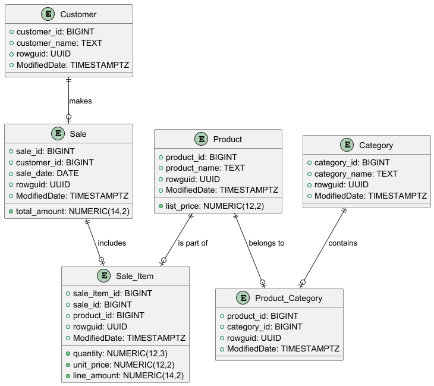
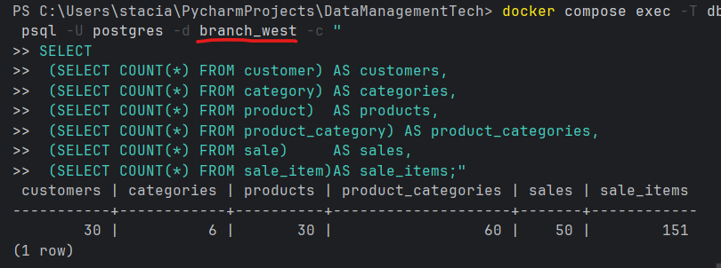
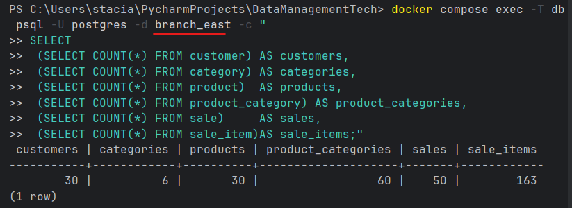
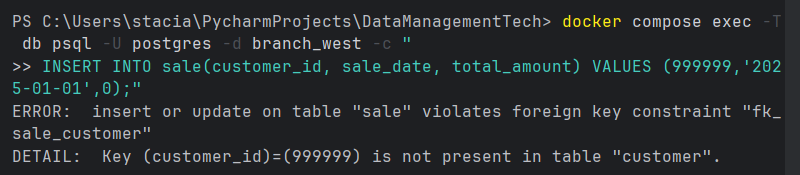
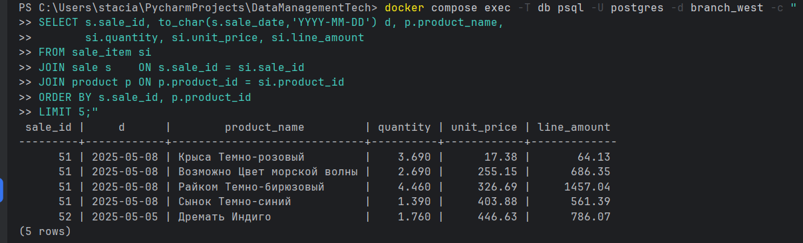
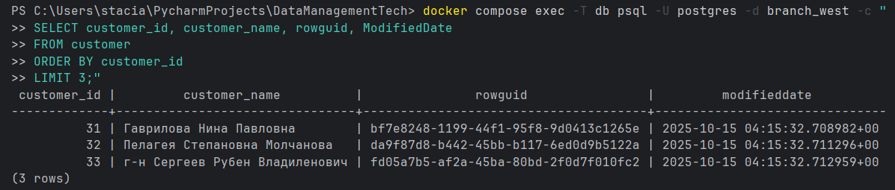

<div align="center">

<h3>Федеральное государственное автономное образовательное учреждение высшего образования</h3>
<h2>Университет ИТМО</h2>

<br/>

<h2>Лабораторная работа №1</h2>
<h3>Филиалы: схема и наполнение базы данных</h3>

<br/><br/>

<table>
  <tr>
    <td align="right"><b>Дисциплина:</b></td>
    <td align="left">Технологии управления данными</td>
  </tr>
  <tr>
    <td align="right"><b>Группа:</b></td>
    <td align="left">M3307</td>
  </tr>
  <tr>
    <td align="right"><b>Студент:</b></td>
    <td align="left">Гринько Анастасия Павловна</td>
  </tr>
  <tr>
    <td align="right"><b>Преподаватель:</b></td>
    <td align="left">Повышев Владислав Вячеславович</td>
  </tr>
</table>

<br/><br/><br/>

<b>Санкт-Петербург</b><br/>
2025

</div>

<div style="page-break-after: always;"></div>


## Цель

Сформировать минимальную модель данных для филиала и развернуть её в двух БД с тестовым наполнением.


## Условие
Разработать прототип БД филиала торгового предприятия, источник для DWH. Модель хранит данные о сущностях: Покупатель, Товар, Сделка.

Покупатель: уникальный идентификатор, наименование.

Товар: уникальный номер (SKU или ID), название, каталожная цена. Товар может входить в несколько Категорий. Связь Товар Категория типа M:N через промежуточную таблицу.

Сделка: факт покупки покупателем. Поля: дата, общая сумма. Покупка состоит из нескольких позиций. Для каждой позиции хранится товар, количество и фактическая цена (может отличаться от каталожной). Связь Сделка Товар реализуется через таблицу строк сделки.

Требуется:

Построить реляционную модель и согласовать с преподавателем. На её основе создать даталогическую модель с учетом типов выбранной СУБД.

Подготовить DDL скрипт со следующими требованиями:

Во всех таблицах суррогатный целочисленный первичный ключ.

В каждой таблице атрибуты rowguid и ModifiedDate.

Связи добавлять отдельными ALTER TABLE.

Минимально необходимые ограничения и триггеры.

Именование объектов на английском языке.

Проверить скрипт. Подготовить два набора вставок для наполнения: не менее 25 строк в базовых сущностях и не менее 50 строк в связующих или фактовых.

Создать две БД по скрипту и наполнить данными. Названия: Филиал Запад и Филиал Восток. Допустимо использовать ИИ для генерации данных.

Выбор реляционной СУБД за студентом. СУБД и набор скриптов согласовать с преподавателем.


## Модель данных

- Customer - покупатель: customer_id (PK), customer_name, служебные rowguid (UUID), ModifiedDate.

- Category - категория товара: category_id (PK), category_name (UNIQUE), rowguid, ModifiedDate.

- Product - товар: product_id (PK), product_name, list_price, rowguid, ModifiedDate.

- Product_Category - мост M:N между Product и Category: составной PK (product_id, category_id), плюс служебные rowguid, ModifiedDate.

- Sale - продажа (шапка чека): sale_id (PK), customer_id (FK -> Customer), sale_date, агрегат total_amount, rowguid, ModifiedDate.

- Sale_Item - позиция чека (ассоциативная сущность для связи M:N между Sale и Product):
sale_item_id (PK), sale_id (FK -> Sale), product_id (FK -> Product), количественные поля quantity, unit_price, line_amount, служебные rowguid, ModifiedDate.




## Скрипты

- `sql/01_schema.sql` - создание таблиц

```sql
-- Подключаем расширение pgcrypto для функции gen_random_uuid()
CREATE EXTENSION IF NOT EXISTS pgcrypto;

-- Таблица customer: покупатели филиала
CREATE TABLE IF NOT EXISTS customer (
    -- Суррогатный первичный ключ
    customer_id   BIGINT GENERATED ALWAYS AS IDENTITY PRIMARY KEY,
    -- Имя покупателя (или название организации)
    customer_name TEXT NOT NULL,
    -- Глобальный идентификатор записи для межсистемной синхронизации
    rowguid       UUID NOT NULL DEFAULT gen_random_uuid(),
    -- Время добавления или последнего изменения записи
    ModifiedDate  TIMESTAMPTZ NOT NULL DEFAULT NOW()
);

-- Таблица category: категории товаров
CREATE TABLE IF NOT EXISTS category (
    -- Суррогатный первичный ключ
    category_id   BIGINT GENERATED ALWAYS AS IDENTITY PRIMARY KEY,
    -- Название категории (уникально)
    category_name TEXT NOT NULL UNIQUE,
    -- Глобальный идентификатор записи
    rowguid       UUID NOT NULL DEFAULT gen_random_uuid(),
    -- Время добавления или последнего изменения записи
    ModifiedDate  TIMESTAMPTZ NOT NULL DEFAULT NOW()
);

-- Таблица product: справочник товаров
CREATE TABLE IF NOT EXISTS product (
    -- Суррогатный первичный ключ
    product_id   BIGINT GENERATED ALWAYS AS IDENTITY PRIMARY KEY,
    -- Название товара
    product_name TEXT NOT NULL,
    -- Каталожная цена (точный десятичный тип: 12 цифр всего, 2 после запятой)
    list_price   NUMERIC(12,2) NOT NULL CHECK (list_price >= 0),
    -- Глобальный идентификатор записи
    rowguid      UUID NOT NULL DEFAULT gen_random_uuid(),
    -- Время добавления или последнего изменения записи
    ModifiedDate TIMESTAMPTZ NOT NULL DEFAULT NOW()
);

-- Таблица product_category: связь M:N между product и category
CREATE TABLE IF NOT EXISTS product_category (
    -- Ссылка на товар
    product_id   BIGINT NOT NULL,
    -- Ссылка на категорию
    category_id  BIGINT NOT NULL,
    -- Глобальный идентификатор записи (для трассировки изменений, не ключ)
    rowguid      UUID NOT NULL DEFAULT gen_random_uuid(),
    -- Время добавления или последнего изменения записи
    ModifiedDate TIMESTAMPTZ NOT NULL DEFAULT NOW(),
    -- Составной первичный ключ исключает дублирование пар товар-категория
    CONSTRAINT pk_product_category PRIMARY KEY (product_id, category_id)
);

-- Таблица sale: шапка продажи
CREATE TABLE IF NOT EXISTS sale (
    -- Суррогатный первичный ключ
    sale_id      BIGINT GENERATED ALWAYS AS IDENTITY PRIMARY KEY,
    -- Покупатель, совершивший сделку
    customer_id  BIGINT NOT NULL,
    -- Дата продажи (без времени)
    sale_date    DATE NOT NULL,
    -- Итоговая сумма по документу продажи
    total_amount NUMERIC(14,2) NOT NULL CHECK (total_amount >= 0),
    -- Глобальный идентификатор записи
    rowguid      UUID NOT NULL DEFAULT gen_random_uuid(),
    -- Время добавления или последнего изменения записи
    ModifiedDate TIMESTAMPTZ NOT NULL DEFAULT NOW()
);

-- Таблица sale_item: строки продажи (позиции)
CREATE TABLE IF NOT EXISTS sale_item (
    -- Суррогатный первичный ключ строки
    sale_item_id BIGINT GENERATED ALWAYS AS IDENTITY PRIMARY KEY,
    -- Ссылка на документ продажи
    sale_id      BIGINT NOT NULL,
    -- Ссылка на товар
    product_id   BIGINT NOT NULL,
    -- Количество товара (дробное, если требуется)
    quantity     NUMERIC(12,3) NOT NULL CHECK (quantity > 0),
    -- Фактическая цена за единицу в момент продажи
    unit_price   NUMERIC(12,2) NOT NULL CHECK (unit_price >= 0),
    -- Сумма по строке: quantity * unit_price
    line_amount  NUMERIC(14,2) NOT NULL CHECK (line_amount >= 0),
    -- Глобальный идентификатор записи
    rowguid      UUID NOT NULL DEFAULT gen_random_uuid(),
    -- Время добавления или последнего изменения записи
    ModifiedDate TIMESTAMPTZ NOT NULL DEFAULT NOW()
);

```

- `sql/02_fk.sql` - внешние ключи

```sql
-- product_category.product_id -> product.product_id
ALTER TABLE IF EXISTS product_category
  ADD CONSTRAINT fk_pc_product
  FOREIGN KEY (product_id) REFERENCES product(product_id);

-- product_category.category_id -> category.category_id
ALTER TABLE IF EXISTS product_category
  ADD CONSTRAINT fk_pc_category
  FOREIGN KEY (category_id) REFERENCES category(category_id);

-- sale.customer_id -> customer.customer_id
ALTER TABLE IF EXISTS sale
  ADD CONSTRAINT fk_sale_customer
  FOREIGN KEY (customer_id) REFERENCES customer(customer_id);

-- sale_item.sale_id -> sale.sale_id
ALTER TABLE IF EXISTS sale_item
  ADD CONSTRAINT fk_sale_item_sale
  FOREIGN KEY (sale_id) REFERENCES sale(sale_id);

-- sale_item.product_id -> product.product_id
ALTER TABLE IF EXISTS sale_item
  ADD CONSTRAINT fk_sale_item_product
  FOREIGN KEY (product_id) REFERENCES product(product_id);


```

- Docker init: `docker/init/00_full_init.sql`

```sql
CREATE DATABASE branch_west;
CREATE DATABASE branch_east;

\connect branch_west
\i /docker/sql/01_schema.sql
\i /docker/sql/02_fk.sql

\connect branch_east
\i /docker/sql/01_schema.sql
\i /docker/sql/02_fk.sql

```

- Сидер: `docker/seeder/seed.py`

```python
import os
import random
from datetime import date, timedelta
import psycopg2
from faker import Faker

# Параметры подключения к PostgreSQL из переменных окружения (с дефолтами)
PGHOST = os.getenv("PGHOST", "localhost")
PGPORT = int(os.getenv("PGPORT", "5432"))
PGUSER = os.getenv("PGUSER", "postgres")
PGPASSWORD = os.getenv("PGPASSWORD", "postgres")
# Можно сидировать сразу несколько БД через переменную DBS (разделитель запятая)
DBS = [db.strip() for db in os.getenv("DBS", "branch_west").split(",")]

# Генератор фейковых данных и фиксированный seed для воспроизводимости
fake = Faker("ru_RU")
random.seed(42)

# Набор категорий для справочника category
CATEGORIES = [
    "Бытовая техника", "Электроника", "Одежда",
    "Спорттовары", "Книги", "Игрушки"
]

# Утилита подключения к конкретной БД
def connect(dbname):
    return psycopg2.connect(
        host=PGHOST, port=PGPORT, user=PGUSER, password=PGPASSWORD, dbname=dbname
    )

# Основная функция сидирования одной БД
def seed_db(dbname):
    conn = connect(dbname)
    # Автокоммит удобен для простого сидера, чтобы не держать большую транзакцию
    conn.autocommit = True
    cur = conn.cursor()

    # Очистка таблиц в порядке, безопасном для FK (детали перед шапками)
    for t in ["sale_item","sale","product_category","product","category","customer"]:
        cur.execute(f"DELETE FROM {t};")

    # Вставка покупателей (customer)
    customers = []
    for _ in range(30):
        name = fake.name()
        cur.execute(
            "INSERT INTO customer(customer_name) VALUES (%s) RETURNING customer_id;",
            (name,)
        )
        customers.append(cur.fetchone()[0])

    # Вставка категорий (category) с защитой от дублей по уникальному имени
    categories = []
    for name in CATEGORIES:
        cur.execute(
            "INSERT INTO category(category_name) VALUES (%s) ON CONFLICT (category_name) DO NOTHING RETURNING category_id;",
            (name,)
        )
        row = cur.fetchone()
        # Если категория уже была, читаем id существующей
        if row is None:
            cur.execute("SELECT category_id FROM category WHERE category_name=%s;", (name,))
            row = cur.fetchone()
        categories.append(row[0])

    # Вставка товаров (product) с рандомной ценой
    products = []
    for i in range(30):
        pname = f"{fake.word().capitalize()} {fake.color_name()}"
        price = round(random.uniform(5, 500), 2)
        cur.execute(
            "INSERT INTO product(product_name, list_price) VALUES (%s, %s) RETURNING product_id;",
            (pname, price)
        )
        products.append(cur.fetchone()[0])

    # Заполнение связей товар категория без дублей (product_category)
    pairs = set()
    while len(pairs) < 60:
        pairs.add((random.choice(products), random.choice(categories)))
    for p, c in pairs:
        cur.execute(
            "INSERT INTO product_category(product_id, category_id) VALUES (%s, %s) ON CONFLICT DO NOTHING;",
            (p, c)
        )

    # Вставка шапок продаж (sale) с нулевой суммой, которую пересчитаем ниже
    sales = []
    for _ in range(50):
        cust = random.choice(customers)
        day = date.today() - timedelta(days=random.randint(0, 180))
        cur.execute(
            "INSERT INTO sale(customer_id, sale_date, total_amount) VALUES (%s, %s, 0) RETURNING sale_id;",
            (cust, day)
        )
        sales.append(cur.fetchone()[0])

    # Вставка строк продаж (sale_item) и пересчет total_amount в sale
    for s in sales:
        n_items = random.randint(1, 5)
        total = 0
        used = set()
        for _ in range(n_items):
            prod = random.choice(products)
            # Исключаем повторение одного и того же товара в рамках одной продажи
            if prod in used:
                continue
            used.add(prod)
            qty = round(random.uniform(1, 5), 2)
            cur.execute("SELECT list_price FROM product WHERE product_id=%s;", (prod,))
            unit_price = float(cur.fetchone()[0])
            amount = round(qty * unit_price, 2)
            total += amount
            cur.execute(
                """INSERT INTO sale_item(sale_id, product_id, quantity, unit_price, line_amount)
                   VALUES (%s,%s,%s,%s,%s);""",
                (s, prod, qty, unit_price, amount)
            )
        # Финальный апдейт суммы по шапке
        cur.execute("UPDATE sale SET total_amount=%s WHERE sale_id=%s;", (round(total, 2), s))

    # Закрываем курсор и соединение
    cur.close()
    conn.close()
    print(f"[OK] Seeded {dbname}")

# Точка входа: сидируем все БД, перечисленные в DBS
def main():
    for db in DBS:
        seed_db(db)

if __name__ == "__main__":
    main()
```

```
## Развёртывание

```bash
docker compose down -v
docker compose up -d --build
```

## Результат заполнения




## Демонстрация целостности связей 
```powershell
docker compose exec -T db psql -U postgres -d branch_west -c "
INSERT INTO sale(customer_id, sale_date, total_amount) VALUES (999999,'2025-01-01',0);"
```

FK добавлены отдельными ALTER, поэтому нельзя создать продажу на несуществующего клиента.

## Деталь чека - ассоциативная сущность M:N с атрибутами
``` powershell
docker compose exec -T db psql -U postgres -d branch_west -c "
SELECT s.sale_id, to_char(s.sale_date,'YYYY-MM-DD') d, p.product_name,
       si.quantity, si.unit_price, si.line_amount
FROM sale_item si
JOIN sale s    ON s.sale_id = si.sale_id
JOIN product p ON p.product_id = si.product_id
ORDER BY s.sale_id, p.product_id
LIMIT 5;"
```

sale_item связывает sale и product + хранит quantity, unit_price, line_amount
## rowguid и ModifiedDate
```powershell
docker compose exec -T db psql -U postgres -d branch_west -c "
SELECT customer_id, customer_name, rowguid, ModifiedDate
FROM customer
ORDER BY customer_id
LIMIT 3;"
```
