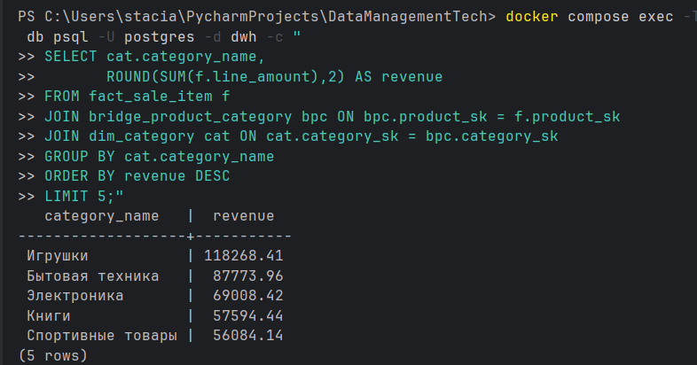
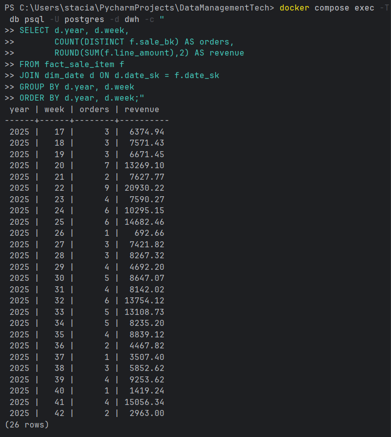
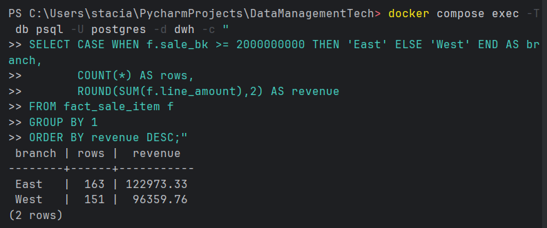

<div align="center">

<h3>Федеральное государственное автономное образовательное учреждение высшего образования</h3>
<h2>Университет ИТМО</h2>

<br/>

<h2>Лабораторная работа №2</h2>
<h3>Разработка модели и скрипта создания хранилища данных</h3>

<br/><br/>

<table>
  <tr>
    <td align="right"><b>Дисциплина:</b></td>
    <td align="left">Технологии управления данными</td>
  </tr>
  <tr>
    <td align="right"><b>Группа:</b></td>
    <td align="left">M3307</td>
  </tr>
  <tr>
    <td align="right"><b>Студент:</b></td>
    <td align="left">Гринько Анастасия Павловна</td>
  </tr>
  <tr>
    <td align="right"><b>Преподаватель:</b></td>
    <td align="left">Повышев Владислав Вячеславович</td>
  </tr>
</table>

<br/><br/><br/>

<b>Санкт-Петербург</b><br/>
2025

</div>

<div style="page-break-after: always;"></div>

## Цель

Создать реляционное хранилище данных (DWH) на основе данных из двух филиалов (branch_west, branch_east), обосновать
выбранную архитектуру (звезда), разработать скрипты создания и тестовой загрузки в автоматизированном режиме из
источников ЛР-1. Для DWH допускается только добавление данных (без модификаций/удалений).

## Условие

Хранилище данных должно реализовано с использованием реляционной СУБД, если иное
не было оговорено заранее. Архитектура хранилища должна соответствовать одной из
устоявшихся практик: Кимбалл, Инмон, Якорная модель, Data vault, или иная практика по
согласованию с преподавателем. Студент обязан в отчете обосновать выбранную
архитектуру. Наполнение будет производится в автоматизированном режиме из данных,
поступающих из источников, разработанных в лабораторной работе №1. Для хранилища
данных предусмотрена только операция добавления данных, операции модификации и
удаления не допустимы.

Пример: Сформировать модель «звезда», в которой основной таблицей фактов будет
продажа конкретного товар, измерениями будут товары, покупатели и т.д.
На основании имеющейся информации можно создать реляционную модель, утвердить ее
у преподавателя. На основании утвержденной модели создать даталогическую модель,
утвердить ее у преподавателя.

На основании созданных моделей создать скрипт создания хранилища данных, проверить
его работоспособность. Создать тестовый (!) скрипт наполнения хранилища, проверить
работоспособность.

## Обоснование архитектуры

Выбрана схема Кимбалл - устоявшаяся практика для аналитики.
Причины выбора:

- Простые и быстрые аналитические запросы: факт в центре, вокруг него описательные измерения.
- Отделение чисел (факт) от описаний (измерения) снижает дублирование и ускоряет группировки.

## Схема DWH


#### Таблица фактов:

fact_sale_item - позиции продаж.
Поля (основные):

Ключи-ссылки: date_sk, customer_sk, product_sk (+ sale_bk, sale_item_bk как бизнес-идентификаторы операции).

Меры: quantity, unit_price, line_amount.
Смысл: хранит "числа" для агрегаций (суммы, количества, средние).

Измерения:

- dim_date - календарь: full_date, year, month, day, week, dow (день недели 1..7).
  Смысл: группировки по времени (недели/месяцы/годы/дни).
- dim_customer - покупатель: customer_bk, customer_name.
- dim_product - товар: product_bk, product_name, list_price.
- dim_category - категория: category_bk, category_name.
  Смысл трёх измерений: "кто купил", "что купили", "к какой категории относится".

## Ключи

BK (Business Key) - внешняя "личность" из источника. Чтобы не пересекались между филиалами, добавлен префикс филиала: 1
*1e9 + id для West и 2*1e9 + id для East.

SK (Surrogate Key) - внутренний авто-идентификатор в DWH (*_sk) для быстрых джойнов в факте и возможной историзации.
Загрузка: берём BK из источника -> находим/создаём строку в измерении -> получаем SK -> пишем SK в факт.

## Выполнение

```bash
docker compose exec -T db psql -U postgres -f docker/sql/10_create_dwh.sql
docker compose exec -T db psql -U postgres -d dwh -f docker/sql/11_fk.sql
docker compose exec -T db psql -U postgres -d dwh -f docker/sql/12_test_load.sql
```

## Проверка

```powershell
docker compose exec -T db psql -U postgres -d dwh -c "
SELECT
 (SELECT COUNT(*) FROM dim_date)     AS dim_date,
 (SELECT COUNT(*) FROM dim_customer) AS dim_customer,
 (SELECT COUNT(*) FROM dim_product)  AS dim_product,
 (SELECT COUNT(*) FROM dim_category) AS dim_category,
 (SELECT COUNT(*) FROM bridge_product_category) AS bridge_pc,
 (SELECT COUNT(*) FROM fact_sale_item) AS fact_rows;
"
```


## Топ категорий по выручке (JOIN через мост)

```powershell
docker compose exec -T db psql -U postgres -d dwh -c "
SELECT cat.category_name,
       ROUND(SUM(f.line_amount),2) AS revenue
FROM fact_sale_item f
JOIN bridge_product_category bpc ON bpc.product_sk = f.product_sk
JOIN dim_category cat ON cat.category_sk = bpc.category_sk
GROUP BY cat.category_name
ORDER BY revenue DESC
LIMIT 5;"

```



## Продажи по неделям (год, неделя, заказы, выручка)

```powershell
docker compose exec -T db psql -U postgres -d dwh -c "
SELECT d.year, d.week,
       COUNT(DISTINCT f.sale_bk) AS orders,
       ROUND(SUM(f.line_amount),2) AS revenue
FROM fact_sale_item f
JOIN dim_date d ON d.date_sk = f.date_sk
GROUP BY d.year, d.week
ORDER BY d.year, d.week;"
```



## Разделение по филиалам

```powershell
docker compose exec -T db psql -U postgres -d dwh -c "
SELECT CASE WHEN f.sale_bk >= 2000000000 THEN 'East' ELSE 'West' END AS branch,
       COUNT(*) AS rows,
       ROUND(SUM(f.line_amount),2) AS revenue
FROM fact_sale_item f
GROUP BY 1
ORDER BY revenue DESC;"
```



- `sql/10_create_dwh.sql` (написан ИИ, доработан мной)

```sql 
-- создаём отдельную БД под DWH
CREATE DATABASE dwh;

-- переключаемся в неё
\connect dwh

-- расширение для gen_random_uuid()
CREATE EXTENSION IF NOT EXISTS pgcrypto;

-- Календарь (измерение "когда")
CREATE TABLE IF NOT EXISTS dim_date (
  date_sk      BIGINT GENERATED ALWAYS AS IDENTITY PRIMARY KEY, -- суррогатный ключ (SK)
  full_date    DATE NOT NULL UNIQUE, -- сама дата (уникальна)
  year         INT NOT NULL, -- год, для группировок
  month        INT NOT NULL, -- месяц
  day          INT NOT NULL, -- день месяца
  week         INT NOT NULL, -- номер недели (ISO)
  dow          INT NOT NULL, -- день недели 1..7 (ISO)
  rowguid      UUID NOT NULL DEFAULT gen_random_uuid(), -- служебный GUID
  modifieddate TIMESTAMPTZ NOT NULL DEFAULT now() -- штамп изменения
);

-- Измерение "кто" (покупатель)
CREATE TABLE IF NOT EXISTS dim_customer (
  customer_sk   BIGINT GENERATED ALWAYS AS IDENTITY PRIMARY KEY, -- SK
  customer_bk   BIGINT NOT NULL UNIQUE, -- BK (префикс филиала*1e9 + id)
  customer_name TEXT NOT NULL, -- имя покупателя
  rowguid       UUID NOT NULL DEFAULT gen_random_uuid(),
  modifieddate  TIMESTAMPTZ NOT NULL DEFAULT now()
);

-- Измерение "что" (товар)
CREATE TABLE IF NOT EXISTS dim_product (
  product_sk    BIGINT GENERATED ALWAYS AS IDENTITY PRIMARY KEY, -- SK
  product_bk    BIGINT NOT NULL UNIQUE, -- BK (с префиксом филиала)
  product_name  TEXT NOT NULL, -- название товара
  list_price    NUMERIC(12,2) NOT NULL CHECK (list_price >= 0), -- базовая цена (точный тип)
  rowguid       UUID NOT NULL DEFAULT gen_random_uuid(),
  modifieddate  TIMESTAMPTZ NOT NULL DEFAULT now()
);

-- Измерение "категория"
CREATE TABLE IF NOT EXISTS dim_category (
  category_sk   BIGINT GENERATED ALWAYS AS IDENTITY PRIMARY KEY, -- SK
  category_bk   BIGINT NOT NULL UNIQUE, -- BK (с префиксом филиала)
  category_name TEXT NOT NULL, -- название категории
  rowguid       UUID NOT NULL DEFAULT gen_random_uuid(),
  modifieddate  TIMESTAMPTZ NOT NULL DEFAULT now()
);

-- Мост M:N между товаром и категорией (в DWH - по SK)
CREATE TABLE IF NOT EXISTS bridge_product_category (
  product_sk    BIGINT NOT NULL, -- ссылка на dim_product
  category_sk   BIGINT NOT NULL, -- ссылка на dim_category
  rowguid       UUID NOT NULL DEFAULT gen_random_uuid(),
  modifieddate  TIMESTAMPTZ NOT NULL DEFAULT now(),
  CONSTRAINT pk_bridge_pc PRIMARY KEY (product_sk, category_sk) -- не допускает дублей
);

-- Таблица фактов: позиции продаж (меры + ссылки на измерения)
CREATE TABLE IF NOT EXISTS fact_sale_item (
  fact_sk        BIGINT GENERATED ALWAYS AS IDENTITY PRIMARY KEY, -- технический ключ строки факта
  sale_item_bk   BIGINT NOT NULL UNIQUE, -- BK строки продажи (с префиксом)
  sale_bk        BIGINT NOT NULL, -- BK продажи (чека)
  customer_sk    BIGINT NOT NULL, -- ссылка на покупателя (SK)
  product_sk     BIGINT NOT NULL, -- ссылка на товар (SK)
  date_sk        BIGINT NOT NULL, -- ссылка на дату (SK)
  quantity       NUMERIC(12,3) NOT NULL CHECK (quantity > 0), -- количество
  unit_price     NUMERIC(12,2) NOT NULL CHECK (unit_price >= 0), -- цена за единицу
  line_amount    NUMERIC(14,2) NOT NULL CHECK (line_amount >= 0), -- сумма по строке
  rowguid        UUID NOT NULL DEFAULT gen_random_uuid(),
  modifieddate   TIMESTAMPTZ NOT NULL DEFAULT now()
);


```

- `sql/11_fk.sql` (написан ИИ, доработан мной)

```sql
-- работаем в БД dwh
\connect dwh

-- Внешние ключи для моста: продукт и категория должны существовать в соответствующих измерениях
ALTER TABLE bridge_product_category
  ADD CONSTRAINT fk_bpc_product  FOREIGN KEY (product_sk)  REFERENCES dim_product(product_sk),
  ADD CONSTRAINT fk_bpc_category FOREIGN KEY (category_sk) REFERENCES dim_category(category_sk);

-- Внешние ключи в факте: ссылки на измерения "кто/что/когда"
ALTER TABLE fact_sale_item
  ADD CONSTRAINT fk_fact_customer FOREIGN KEY (customer_sk) REFERENCES dim_customer(customer_sk),
  ADD CONSTRAINT fk_fact_product  FOREIGN KEY (product_sk)  REFERENCES dim_product(product_sk),
  ADD CONSTRAINT fk_fact_date     FOREIGN KEY (date_sk)     REFERENCES dim_date(date_sk);

```

- `sql/12_test_load.sql` (написан мной, частично доработан и расширен с помощью ИИ)

```sql
-- Подключаем FDW для доступа к удалённым (в нашем случае — соседним) БД
CREATE EXTENSION IF NOT EXISTS postgres_fdw;

-- Описываем серверы-источники: west и east (контейнер db, БД филиалов)
DROP SERVER IF EXISTS srv_west CASCADE;
CREATE SERVER srv_west FOREIGN DATA WRAPPER postgres_fdw
  OPTIONS (host 'db', dbname 'branch_west', port '5432');

DROP SERVER IF EXISTS srv_east CASCADE;
CREATE SERVER srv_east FOREIGN DATA WRAPPER postgres_fdw
  OPTIONS (host 'db', dbname 'branch_east', port '5432');

-- Пользовательские маппинги: под кем ходим в источники
CREATE USER MAPPING IF NOT EXISTS FOR postgres SERVER srv_west
  OPTIONS (user 'postgres', password 'stacia');
CREATE USER MAPPING IF NOT EXISTS FOR postgres SERVER srv_east
  OPTIONS (user 'postgres', password 'stacia');

-- Схемы-приёмники для foreign-таблиц
CREATE SCHEMA IF NOT EXISTS src_west;
CREATE SCHEMA IF NOT EXISTS src_east;

-- Импортируем только нужные таблицы из public West -> src_west
IMPORT FOREIGN SCHEMA public
  LIMIT TO (customer, category, product, product_category, sale, sale_item)
  FROM SERVER srv_west INTO src_west;

-- И из East -> src_east
IMPORT FOREIGN SCHEMA public
  LIMIT TO (customer, category, product, product_category, sale, sale_item)
  FROM SERVER srv_east INTO src_east;

-- === Заполнение измерений: BK формируется как префикс филиала * 1e9 + id ===

-- Покупатели: West
INSERT INTO dim_customer(customer_bk, customer_name)
SELECT DISTINCT 1*1000000000 + c.customer_id, c.customer_name
FROM src_west.customer c
ON CONFLICT (customer_bk) DO NOTHING; -- идемпотентность

-- Покупатели: East
INSERT INTO dim_customer(customer_bk, customer_name)
SELECT DISTINCT 2*1000000000 + c.customer_id, c.customer_name
FROM src_east.customer c
ON CONFLICT (customer_bk) DO NOTHING;

-- Категории (объединяем оба источника; BK с префиксом)
INSERT INTO dim_category(category_bk, category_name)
SELECT DISTINCT 1*1000000000 + c.category_id, c.category_name FROM src_west.category c
UNION ALL
SELECT DISTINCT 2*1000000000 + c.category_id, c.category_name FROM src_east.category c
ON CONFLICT (category_bk) DO NOTHING;

-- Товары: West
INSERT INTO dim_product(product_bk, product_name, list_price)
SELECT DISTINCT 1*1000000000 + p.product_id, p.product_name, p.list_price
FROM src_west.product p
ON CONFLICT (product_bk) DO NOTHING;

-- Товары: East
INSERT INTO dim_product(product_bk, product_name, list_price)
SELECT DISTINCT 2*1000000000 + p.product_id, p.product_name, p.list_price
FROM src_east.product p
ON CONFLICT (product_bk) DO NOTHING;

-- Мост товар–категория: переводим внешние id -> внутренние SK измерений (через BK)
INSERT INTO bridge_product_category(product_sk, category_sk)
SELECT dp.product_sk, dc.category_sk
FROM src_west.product_category pc
JOIN dim_product  dp ON dp.product_bk  = 1*1000000000 + pc.product_id
JOIN dim_category dc ON dc.category_bk = 1*1000000000 + pc.category_id
ON CONFLICT DO NOTHING;

INSERT INTO bridge_product_category(product_sk, category_sk)
SELECT dp.product_sk, dc.category_sk
FROM src_east.product_category pc
JOIN dim_product  dp ON dp.product_bk  = 2*1000000000 + pc.product_id
JOIN dim_category dc ON dc.category_bk = 2*1000000000 + pc.category_id
ON CONFLICT DO NOTHING;

-- Календарь (dim_date): строим диапазон дат по min/max из обеих БД
WITH bounds AS (
  SELECT
    LEAST(   (SELECT MIN(sale_date) FROM src_west.sale),
             (SELECT MIN(sale_date) FROM src_east.sale)) AS dmin,
    GREATEST((SELECT MAX(sale_date) FROM src_west.sale),
             (SELECT MAX(sale_date) FROM src_east.sale)) AS dmax
),
series AS (
  SELECT generate_series(dmin, dmax, interval '1 day')::date AS d
  FROM bounds
)
INSERT INTO dim_date(full_date, year, month, day, week, dow)
SELECT
  d,
  EXTRACT(YEAR   FROM d)::int,
  EXTRACT(MONTH  FROM d)::int,
  EXTRACT(DAY    FROM d)::int,
  EXTRACT(WEEK   FROM d)::int, -- номер недели (ISO)
  EXTRACT(ISODOW FROM d)::int -- день недели 1..7 (ISO)
FROM series
ON CONFLICT (full_date) DO NOTHING;

-- === Факт: вставляем строки продаж, переводя BK -> SK через CTE ===

-- West
WITH d AS (SELECT date_sk, full_date FROM dim_date),
     cust AS (SELECT customer_sk, customer_bk FROM dim_customer),
     prod AS (SELECT product_sk,  product_bk FROM dim_product)
INSERT INTO fact_sale_item(
  sale_item_bk, sale_bk, customer_sk, product_sk, date_sk,
  quantity, unit_price, line_amount
)
SELECT
  1*1000000000000 + si.sale_item_id, -- BK строки продажи (уникален в DWH)
  1*1000000000    + s.sale_id, -- BK продажи (чека)
  cu.customer_sk, -- SK покупателя
  pr.product_sk, -- SK товара
  dd.date_sk, -- SK даты
  si.quantity, si.unit_price, si.line_amount -- меры
FROM src_west.sale_item si
JOIN src_west.sale s ON s.sale_id = si.sale_id
JOIN prod  pr ON pr.product_bk = 1*1000000000 + si.product_id
JOIN cust  cu ON cu.customer_bk = 1*1000000000 + s.customer_id
JOIN d     dd ON dd.full_date   = s.sale_date
ON CONFLICT (sale_item_bk) DO NOTHING;

-- East (используем тот же приём; CTE заново объявляем)
WITH d AS (SELECT date_sk, full_date FROM dim_date),
     cust AS (SELECT customer_sk, customer_bk FROM dim_customer),
     prod AS (SELECT product_sk,  product_bk FROM dim_product)
INSERT INTO fact_sale_item(
  sale_item_bk, sale_bk, customer_sk, product_sk, date_sk,
  quantity, unit_price, line_amount
)
SELECT
  2*1000000000000 + si.sale_item_id,
  2*1000000000    + s.sale_id,
  cu.customer_sk,
  pr.product_sk,
  dd.date_sk,
  si.quantity, si.unit_price, si.line_amount
FROM src_east.sale_item si
JOIN src_east.sale s ON s.sale_id = si.sale_id
JOIN prod  pr ON pr.product_bk = 2*1000000000 + si.product_id
JOIN cust  cu ON cu.customer_bk = 2*1000000000 + s.customer_id
JOIN d     dd ON dd.full_date = s.sale_date
ON CONFLICT (sale_item_bk) DO NOTHING;

```

