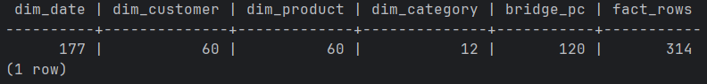

<div align="center">

<h3>Федеральное государственное автономное образовательное учреждение высшего образования</h3>
<h2>Университет ИТМО</h2>

<br/>

<h2>Лабораторная работа №2</h2>
<h3>DWH: миграции и загрузка (FDW + сидирование)</h3>

<br/><br/>

<table>
  <tr>
    <td align="right"><b>Дисциплина:</b></td>
    <td align="left">Технологии управления данными</td>
  </tr>
  <tr>
    <td align="right"><b>Группа:</b></td>
    <td align="left">M3307</td>
  </tr>
  <tr>
    <td align="right"><b>Студент:</b></td>
    <td align="left">Гринько Анастасия Павловна</td>
  </tr>
  <tr>
    <td align="right"><b>Преподаватель:</b></td>
    <td align="left">Повышев Владислав Вячеславович</td>
  </tr>
</table>

<br/><br/><br/>

<b>Санкт-Петербург</b><br/>
2025

</div>

<div style="page-break-after: always;"></div>

## Цель

Поднять базу `dwh`, применить миграции (схема + внешние ключи) и выполнить тестовую загрузку данных из `branch_west` и
`branch_east` через `postgres_fdw`.

## Краткая схема DWH (описание)

- Измерения: `dim_customer`, `dim_product`, `dim_category`, `dim_date`.
- Мост M:N: `bridge_product_category (product_sk, category_sk)`.
- Факт: `fact_sale_item (date_sk, customer_sk, product_sk, measures)`.

## Выполнение

```bash
docker compose exec -T db psql -U postgres -f docker/sql/10_create_dwh.sql
docker compose exec -T db psql -U postgres -d dwh -f docker/sql/11_fk.sql
docker compose exec -T db psql -U postgres -d dwh -f docker/sql/12_test_load.sql
```

## Проверка

```sql
SELECT
 (SELECT COUNT(*) FROM dim_date)     AS dim_date,
 (SELECT COUNT(*) FROM dim_customer) AS dim_customer,
 (SELECT COUNT(*) FROM dim_product)  AS dim_product,
 (SELECT COUNT(*) FROM dim_category) AS dim_category,
 (SELECT COUNT(*) FROM bridge_product_category) AS bridge_pc,
 (SELECT COUNT(*) FROM fact_sale_item) AS fact_rows;

```



- `sql/10_create_dwh.sql`

```sql
CREATE DATABASE dwh;

\connect dwh

CREATE EXTENSION IF NOT EXISTS pgcrypto;


CREATE TABLE IF NOT EXISTS dim_date (
  date_sk      BIGINT GENERATED ALWAYS AS IDENTITY PRIMARY KEY,
  full_date    DATE NOT NULL UNIQUE,
  year         INT NOT NULL,
  month        INT NOT NULL,
  day          INT NOT NULL,
  week         INT NOT NULL,
  dow          INT NOT NULL,
  rowguid      UUID NOT NULL DEFAULT gen_random_uuid(),
  modifieddate TIMESTAMPTZ NOT NULL DEFAULT now()
);

CREATE TABLE IF NOT EXISTS dim_customer (
  customer_sk  BIGINT GENERATED ALWAYS AS IDENTITY PRIMARY KEY,
  customer_bk  BIGINT NOT NULL UNIQUE,
  customer_name TEXT NOT NULL,
  rowguid      UUID NOT NULL DEFAULT gen_random_uuid(),
  modifieddate TIMESTAMPTZ NOT NULL DEFAULT now()
);

CREATE TABLE IF NOT EXISTS dim_product (
  product_sk   BIGINT GENERATED ALWAYS AS IDENTITY PRIMARY KEY,
  product_bk   BIGINT NOT NULL UNIQUE,
  product_name TEXT NOT NULL,
  list_price   NUMERIC(12,2) NOT NULL CHECK (list_price >= 0),
  rowguid      UUID NOT NULL DEFAULT gen_random_uuid(),
  modifieddate TIMESTAMPTZ NOT NULL DEFAULT now()
);

CREATE TABLE IF NOT EXISTS dim_category (
  category_sk  BIGINT GENERATED ALWAYS AS IDENTITY PRIMARY KEY,
  category_bk  BIGINT NOT NULL UNIQUE,
  category_name TEXT NOT NULL,
  rowguid      UUID NOT NULL DEFAULT gen_random_uuid(),
  modifieddate TIMESTAMPTZ NOT NULL DEFAULT now()
);

CREATE TABLE IF NOT EXISTS bridge_product_category (
  product_sk   BIGINT NOT NULL,
  category_sk  BIGINT NOT NULL,
  rowguid      UUID NOT NULL DEFAULT gen_random_uuid(),
  modifieddate TIMESTAMPTZ NOT NULL DEFAULT now(),
  CONSTRAINT pk_bridge_pc PRIMARY KEY (product_sk, category_sk)
);

CREATE TABLE IF NOT EXISTS fact_sale_item (
  fact_sk        BIGINT GENERATED ALWAYS AS IDENTITY PRIMARY KEY,
  sale_item_bk   BIGINT NOT NULL UNIQUE,
  sale_bk        BIGINT NOT NULL,
  customer_sk    BIGINT NOT NULL,
  product_sk     BIGINT NOT NULL,
  date_sk        BIGINT NOT NULL,
  quantity       NUMERIC(12,3) NOT NULL CHECK (quantity > 0),
  unit_price     NUMERIC(12,2) NOT NULL CHECK (unit_price >= 0),
  line_amount    NUMERIC(14,2) NOT NULL CHECK (line_amount >= 0),
  rowguid        UUID NOT NULL DEFAULT gen_random_uuid(),
  modifieddate   TIMESTAMPTZ NOT NULL DEFAULT now()
);

```

- `sql/11_fk.sql`

```sql
\connect dwh

ALTER TABLE bridge_product_category
  ADD CONSTRAINT fk_bpc_product FOREIGN KEY (product_sk) REFERENCES dim_product(product_sk),
  ADD CONSTRAINT fk_bpc_category FOREIGN KEY (category_sk) REFERENCES dim_category(category_sk);

ALTER TABLE fact_sale_item
  ADD CONSTRAINT fk_fact_customer FOREIGN KEY (customer_sk) REFERENCES dim_customer(customer_sk),
  ADD CONSTRAINT fk_fact_product  FOREIGN KEY (product_sk)   REFERENCES dim_product(product_sk),
  ADD CONSTRAINT fk_fact_date     FOREIGN KEY (date_sk)      REFERENCES dim_date(date_sk);

CREATE INDEX IF NOT EXISTS ix_fact_date    ON fact_sale_item(date_sk);
CREATE INDEX IF NOT EXISTS ix_fact_product ON fact_sale_item(product_sk);
CREATE INDEX IF NOT EXISTS ix_fact_cust    ON fact_sale_item(customer_sk);

```

- `sql/12_test_load.sql`

```sql
CREATE EXTENSION IF NOT EXISTS postgres_fdw;

DROP SERVER IF EXISTS srv_west CASCADE;
CREATE SERVER srv_west FOREIGN DATA WRAPPER postgres_fdw
  OPTIONS (host 'db', dbname 'branch_west', port '5432');

DROP SERVER IF EXISTS srv_east CASCADE;
CREATE SERVER srv_east FOREIGN DATA WRAPPER postgres_fdw
  OPTIONS (host 'db', dbname 'branch_east', port '5432');

CREATE USER MAPPING IF NOT EXISTS FOR postgres SERVER srv_west
  OPTIONS (user 'postgres', password 'stacia');
CREATE USER MAPPING IF NOT EXISTS FOR postgres SERVER srv_east
  OPTIONS (user 'postgres', password 'stacia');

CREATE SCHEMA IF NOT EXISTS src_west;
CREATE SCHEMA IF NOT EXISTS src_east;

IMPORT FOREIGN SCHEMA public
  LIMIT TO (customer, category, product, product_category, sale, sale_item)
  FROM SERVER srv_west INTO src_west;

IMPORT FOREIGN SCHEMA public
  LIMIT TO (customer, category, product, product_category, sale, sale_item)
  FROM SERVER srv_east INTO src_east;

INSERT INTO dim_customer(customer_bk, customer_name)
SELECT DISTINCT 1*1000000000 + c.customer_id, c.customer_name FROM src_west.customer c
ON CONFLICT (customer_bk) DO NOTHING;

INSERT INTO dim_customer(customer_bk, customer_name)
SELECT DISTINCT 2*1000000000 + c.customer_id, c.customer_name FROM src_east.customer c
ON CONFLICT (customer_bk) DO NOTHING;

INSERT INTO dim_category(category_bk, category_name)
SELECT DISTINCT 1*1000000000 + c.category_id, c.category_name FROM src_west.category c
UNION ALL
SELECT DISTINCT 2*1000000000 + c.category_id, c.category_name FROM src_east.category c
ON CONFLICT (category_bk) DO NOTHING;

INSERT INTO dim_product(product_bk, product_name, list_price)
SELECT DISTINCT 1*1000000000 + p.product_id, p.product_name, p.list_price
FROM src_west.product p
ON CONFLICT (product_bk) DO NOTHING;

INSERT INTO dim_product(product_bk, product_name, list_price)
SELECT DISTINCT 2*1000000000 + p.product_id, p.product_name, p.list_price
FROM src_east.product p
ON CONFLICT (product_bk) DO NOTHING;

INSERT INTO bridge_product_category(product_sk, category_sk)
SELECT dp.product_sk, dc.category_sk
FROM src_west.product_category pc
JOIN dim_product  dp ON dp.product_bk  = 1*1000000000 + pc.product_id
JOIN dim_category dc ON dc.category_bk = 1*1000000000 + pc.category_id
ON CONFLICT DO NOTHING;

INSERT INTO bridge_product_category(product_sk, category_sk)
SELECT dp.product_sk, dc.category_sk
FROM src_east.product_category pc
JOIN dim_product  dp ON dp.product_bk  = 2*1000000000 + pc.product_id
JOIN dim_category dc ON dc.category_bk = 2*1000000000 + pc.category_id
ON CONFLICT DO NOTHING;

WITH bounds AS (
  SELECT
    LEAST((SELECT MIN(sale_date) FROM src_west.sale),
          (SELECT MIN(sale_date) FROM src_east.sale)) AS dmin,
    GREATEST((SELECT MAX(sale_date) FROM src_west.sale),
             (SELECT MAX(sale_date) FROM src_east.sale)) AS dmax
),
series AS (
  SELECT generate_series(dmin, dmax, interval '1 day')::date AS d
  FROM bounds
)
INSERT INTO dim_date(full_date, year, month, day, week, dow)
SELECT
  d,
  EXTRACT(YEAR   FROM d)::int,
  EXTRACT(MONTH  FROM d)::int,
  EXTRACT(DAY    FROM d)::int,
  EXTRACT(WEEK   FROM d)::int,
  EXTRACT(ISODOW FROM d)::int  
FROM series
ON CONFLICT (full_date) DO NOTHING;


WITH d AS (SELECT date_sk, full_date FROM dim_date),
     cust AS (SELECT customer_sk, customer_bk FROM dim_customer),
     prod AS (SELECT product_sk, product_bk FROM dim_product)
INSERT INTO fact_sale_item(
  sale_item_bk, sale_bk, customer_sk, product_sk, date_sk,
  quantity, unit_price, line_amount
)
SELECT
  1*1000000000000 + si.sale_item_id,  
  1*1000000000    + s.sale_id, 
  cu.customer_sk,
  pr.product_sk,
  dd.date_sk,
  si.quantity, si.unit_price, si.line_amount
FROM src_west.sale_item si
JOIN src_west.sale s ON s.sale_id = si.sale_id
JOIN prod  pr ON pr.product_bk = 1*1000000000 + si.product_id
JOIN cust  cu ON cu.customer_bk = 1*1000000000 + s.customer_id
JOIN d     dd ON dd.full_date = s.sale_date
ON CONFLICT (sale_item_bk) DO NOTHING;

WITH d AS (SELECT date_sk, full_date FROM dim_date),
     cust AS (SELECT customer_sk, customer_bk FROM dim_customer),
     prod AS (SELECT product_sk, product_bk FROM dim_product)
INSERT INTO fact_sale_item(
  sale_item_bk, sale_bk, customer_sk, product_sk, date_sk,
  quantity, unit_price, line_amount
)
SELECT
  2*1000000000000 + si.sale_item_id,
  2*1000000000    + s.sale_id,
  cu.customer_sk,
  pr.product_sk,
  dd.date_sk,
  si.quantity, si.unit_price, si.line_amount
FROM src_east.sale_item si
JOIN src_east.sale s ON s.sale_id = si.sale_id
JOIN prod  pr ON pr.product_bk = 2*1000000000 + si.product_id
JOIN cust  cu ON cu.customer_bk = 2*1000000000 + s.customer_id
JOIN d     dd ON dd.full_date = s.sale_date
ON CONFLICT (sale_item_bk) DO NOTHING;

```

