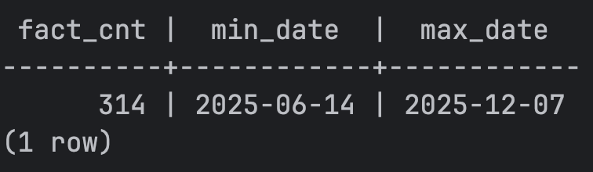
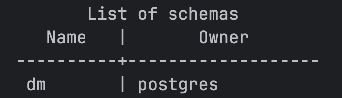
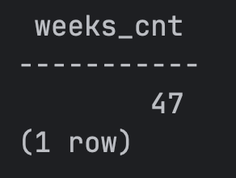
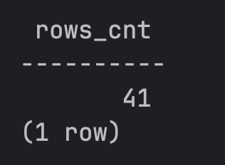
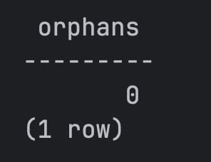
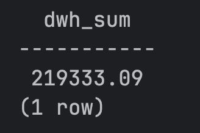
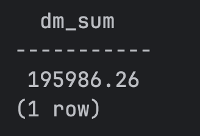
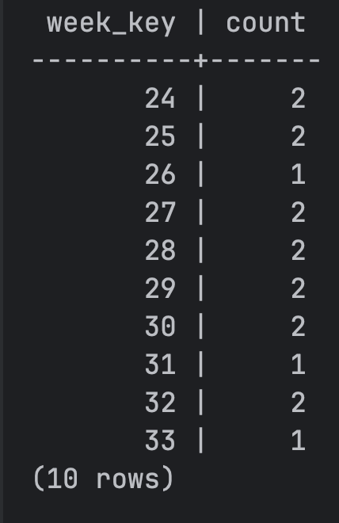

<div align="center">

<h3>Федеральное государственное автономное образовательное учреждение высшего образования</h3>
<h2>Университет ИТМО</h2>

<br/>

<h2>Лабораторная работа №5</h2>
<h3>Процедура наполнения витрины данных</h3>

<br/><br/>

<table>
  <tr>
    <td align="right"><b>Дисциплина:</b></td>
    <td align="left">Технологии управления данными</td>
  </tr>
  <tr>
    <td align="right"><b>Группа:</b></td>
    <td align="left">M3307</td>
  </tr>
  <tr>
    <td align="right"><b>Студент:</b></td>
    <td align="left">Гринько Анастасия Павловна</td>
  </tr>
  <tr>
    <td align="right"><b>Преподаватель:</b></td>
    <td align="left">Повышев Владислав Вячеславович</td>
  </tr>
</table>

<br/><br/><br/>

<b>Санкт-Петербург</b><br/>
2025

</div>

<div style="page-break-after: always;"></div>

# 1. Цель работы

Разработать параметризованную процедуру для частичной загрузки витрины данных (data mart) на основе DWH.  
В отличие от ЛР‑3, требуется перерасчёт только за выбранный период: от p_start_date до p_end_date.

# 2. Условие

Необходимо:
- удалить строки витрины только за нужные недели;
- пересоздать таблицу dm.dim_week в указанном диапазоне;
- заполнить таблицу dm.fact_week_sales агрегатами из dwh.fact_sale_item;
- обеспечить многократный вызов процедуры без дублирования.

Источником является DWH, созданный в ЛР‑2.

# 3. Модель витрины

## 3.1. dm.dim_week
- week_key (PK, BIGSERIAL)  
- iso_year, iso_week  
- week_start_date, week_end_date  
- уникальность (iso_year, iso_week)

## 3.2. dm.fact_week_sales
- Гранулярность: филиал × неделя  
- Метрики: revenue_total, items_qty_total, orders_count, customers_count, avg_check, avg_items_per_order

# 4. Реализация процедуры

```sql
CREATE OR REPLACE PROCEDURE dm.load_week_sales_range(
    p_start_date DATE,
    p_end_date   DATE
)
LANGUAGE plpgsql
AS $$
BEGIN
    DELETE FROM dm.fact_week_sales f
    USING dm.dim_week w
    WHERE f.week_key = w.week_key
      AND w.week_start_date >= p_start_date
      AND w.week_end_date   <= p_end_date;

    DELETE FROM dm.dim_week
    WHERE week_start_date >= p_start_date
      AND week_end_date   <= p_end_date;

    WITH base AS (
        SELECT gs::date AS full_date,
               EXTRACT(ISOYEAR FROM gs)::int AS iso_year,
               EXTRACT(WEEK    FROM gs)::int AS iso_week,
               EXTRACT(ISODOW  FROM gs)::int AS isodow
        FROM generate_series(p_start_date, p_end_date, interval '1 day') gs
    ),
    weeks AS (
        SELECT
            iso_year,
            iso_week,
            (MIN(full_date) - (MIN(isodow)-1) * INTERVAL '1 day')::date AS week_start_date,
            ((MIN(full_date) - (MIN(isodow)-1) * INTERVAL '1 day') + INTERVAL '6 day')::date AS week_end_date
        FROM base
        GROUP BY iso_year, iso_week
    )
    INSERT INTO dm.dim_week(iso_year, iso_week, week_start_date, week_end_date)
    SELECT iso_year, iso_week, week_start_date, week_end_date
    FROM weeks
    ORDER BY iso_year, iso_week
    ON CONFLICT (iso_year, iso_week) DO NOTHING;

    INSERT INTO dm.fact_week_sales(
        branch_key, week_key,
        revenue_total, items_qty_total, orders_count, customers_count,
        avg_check, avg_items_per_order
    )
    SELECT
        f.branch_key,
        w.week_key,
        SUM(f.line_amount),
        SUM(f.quantity),
        COUNT(DISTINCT f.sale_id),
        COUNT(DISTINCT f.customer_key),
        CASE WHEN COUNT(DISTINCT f.sale_id)=0 THEN 0
            ELSE SUM(f.line_amount)/COUNT(DISTINCT f.sale_id)
        END,
        CASE WHEN COUNT(DISTINCT f.sale_id)=0 THEN 0
            ELSE SUM(f.quantity)/COUNT(DISTINCT f.sale_id)
        END
    FROM dwh.fact_sale_item f
    JOIN dwh.dim_date d ON d.date_key = f.date_key
    JOIN dm.dim_week w
      ON w.iso_year = EXTRACT(ISOYEAR FROM d.full_date)::int
     AND w.iso_week = EXTRACT(WEEK    FROM d.full_date)::int
    WHERE d.full_date BETWEEN p_start_date AND p_end_date
    GROUP BY f.branch_key, w.week_key
    ORDER BY w.week_key, f.branch_key;

END;
$$;
```

# 5. Запуск

```bash
docker compose down -v
docker compose up -d --build
docker compose logs -f seeder
```
```bash
docker compose exec -T db psql -U postgres -d dwh -f /docker/sql/22_dwh_load.sql
docker compose exec -T db psql -U postgres -d dwh -c "SELECT COUNT(*) FROM dwh.fact_sale_item;"
```
#### Создание витрины
```bash
docker exec datamanagementtech-db-1 \
  psql -U postgres -d dwh -f /docker/sql/30_dm_schema.sql
```
#### Создание процедуры
```bash
docker exec datamanagementtech-db-1 \
  psql -U postgres -d dwh -f /docker/sql/31_dm_load_range.sql
```
#### Вызов процедуры
```bash
docker exec datamanagementtech-db-1 \
  psql -U postgres -d dwh \
  -c "CALL dm.load_week_sales_range('2025-01-01','2025-11-19');"
```

# 6. Проверка корректности

#### Проверка фактов dwh (что данные вообще есть)

``` bash
docker compose exec -T db \
  psql -U postgres -d dwh -c "
SELECT
  (SELECT COUNT(*) FROM dwh.fact_sale_item) AS fact_cnt,
  (SELECT MIN(d.full_date) FROM dwh.fact_sale_item f JOIN dwh.dim_date d ON d.date_key=f.date_key) AS min_date,
  (SELECT MAX(d.full_date) FROM dwh.fact_sale_item f JOIN dwh.dim_date d ON d.date_key=f.date_key) AS max_date;
"
```

#### Проверка, что схема dm существует
```bash
docker compose exec -T db \
  psql -U postgres -d dwh -c "\dn"
```


#### Проверка наполнения dm.dim_week

``` bash
docker compose exec -T db \
  psql -U postgres -d dwh -c "
SELECT COUNT(*) AS weeks_cnt
FROM dm.dim_week;
"
```


#### Проверка наполнения dm.fact_week_sales

```bash
docker compose exec -T db \
  psql -U postgres -d dwh -c "
SELECT COUNT(*) AS rows_cnt
FROM dm.fact_week_sales;
"
```


#### Проверка связности week_key -> измерение недели
```
docker compose exec -T db \
  psql -U postgres -d dwh -c "
SELECT COUNT(*) AS orphans
FROM dm.fact_week_sales f
LEFT JOIN dm.dim_week w ON w.week_key = f.week_key
WHERE w.week_key IS NULL;
"
```


#### Проверка совпадения сумм (витрина vs DWH)
##### Сумма по фактам DWH:
```bash
docker compose exec -T db \
  psql -U postgres -d dwh -c "
SELECT SUM(line_amount) AS dwh_sum
FROM dwh.fact_sale_item;
"
```

##### Сумма по витрине:
```
docker compose exec -T db \
  psql -U postgres -d dwh -c "
SELECT SUM(revenue_total) AS dm_sum
FROM dm.fact_week_sales;
"
```


#### Проверка корректной группировки (филиалы x недели)
```
docker compose exec -T db \
  psql -U postgres -d dwh -c "
SELECT week_key, COUNT(*)
FROM dm.fact_week_sales
GROUP BY week_key
ORDER BY week_key
LIMIT 10;
"
```
